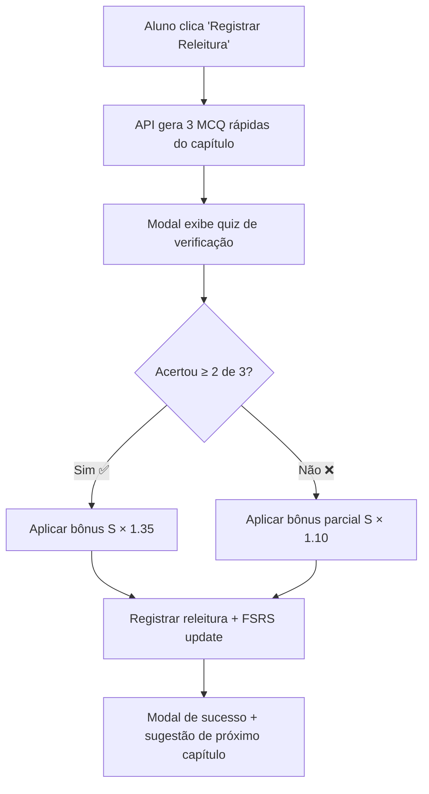
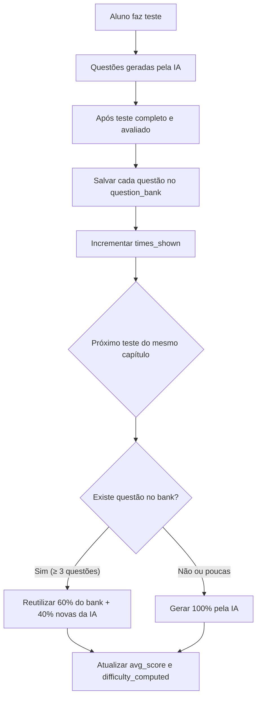
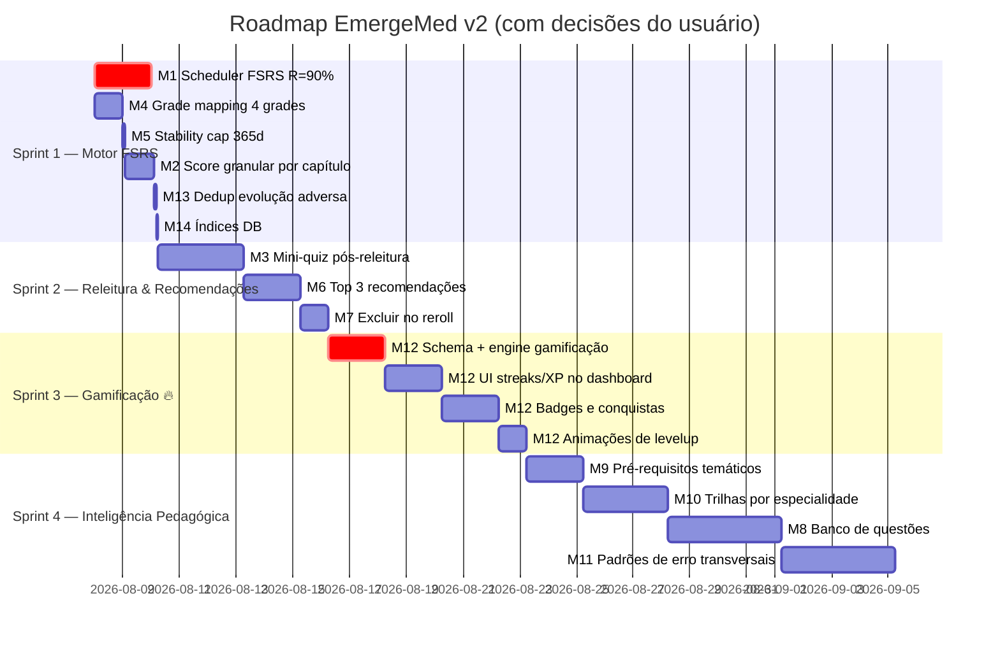

# Plano de Implementação Detalhado — EmergeMed v2

**Data:** 07/08/2026  
**Incorpora todos os comentários do usuário sobre o relatório inicial**

---

## Decisões do Usuário Incorporadas

| Decisão | Ação |
|---------|------|
| ❌ Timer por questão | **REMOVIDO** do plano — não será implementado |
| ❌ Página "Revisões do Dia" | **REMOVIDO** — o tema deve ser sempre surpresa, meta ≈ 1 plantão/dia |
| ❌ Dificuldade progressiva | **REMOVIDO** — todas as questões SEMPRE nível alto (já implementado no prompt) |
| ✅ Stability cap = 365 dias | Alterar de 180 para 365 |
| ✅ Gamificação visual | **PRIORIDADE MÁXIMA** — streaks, badges, conquistas visuais |
| ✅ Top 3 recomendações | 3 opções para o aluno escolher 1 como leitura diária |
| ✅ Mini-quiz obrigatório pós-releitura | Impedir bypass de S sem evidência |
| ✅ Pré-requisitos temáticos | Grafo de dependências entre capítulos |
| ✅ Trilhas por especialidade | Roadmap visual com sequência recomendada |
| ✅ Detecção de padrões de erro | Análise transversal por competência (farmaco, diagnóstico, conduta) |

---

## M1 — Corrigir Scheduler FSRS para R = 90% [CONCLUÍDO ✅]

### Problema Atual
Em [learning-engine.ts L748](file:///c:/Users/souza/planejamento-UPA/lib/learning-engine.ts#L748), o intervalo é calculado como `interval = round(stability)`. Isso significa que quando chega o momento da revisão, a retenção já caiu para R ≈ 50% (ponto de meia-vida da curva exponencial).

### Solução Detalhada
O FSRS calcula o intervalo ideal como: `interval = S × (-ln(desired_retention) / ln(2))`

Para R = 0.90: `-ln(0.90) / ln(2) ≈ 0.1520`  
Para R = 0.85: `-ln(0.85) / ln(2) ≈ 0.2345`

Ou seja, com S = 30 dias e R_target = 0.90, o intervalo real deveria ser ~4.6 dias (não 30 dias).

### Arquivos a Alterar

#### [MODIFY] [learning-engine.ts](file:///c:/Users/souza/planejamento-UPA/lib/learning-engine.ts)

**1. Adicionar constante de desired retention (topo do arquivo, após L4):**
```typescript
export const ALGORITHM_VERSION = 'v2.0-fsrs';
export const DESIRED_RETENTION = 0.90; // Target retention at review time
```

**2. Alterar `calculateFSRSUpdate` (L710-L772) — trecho do cálculo de intervalo:**

Localização atual (L748):
```typescript
// ANTES
interval = Math.max(1, Math.round(stability));
```

Substituir por:
```typescript
// DEPOIS
// Intervalo = S × (-ln(R_target) / ln(2))
// Para R=0.90: fator ≈ 0.1520
const intervalFromRetention = stability * (-Math.log(DESIRED_RETENTION) / Math.LN2);
interval = Math.max(1, Math.round(intervalFromRetention));
```

**3. Aplicar a mesma correção em `calculateFSRSManualReadUpdate` (L775-L804):**

Localização atual (L788):
```typescript
// ANTES
const interval = Math.max(1, Math.round(stability));
```

Substituir por:
```typescript
// DEPOIS
const intervalFromRetention = stability * (-Math.log(DESIRED_RETENTION) / Math.LN2);
const interval = Math.max(1, Math.round(intervalFromRetention));
```

**4. No `deriveAllTopicMetrics`, atualizar o `dueRatio` para considerar o intervalo correto (L347):**

```typescript
// ANTES
const dueRatio = isRead ? Math.min(1.5, Math.max(0.0, daysSinceLastEvidence / stability)) : 0.0;
```

```typescript
// DEPOIS — due ratio relativo ao intervalo real de revisão (não à estabilidade bruta)
const scheduledInterval = stability * (-Math.log(DESIRED_RETENTION) / Math.LN2);
const dueRatio = isRead ? Math.min(2.0, Math.max(0.0, daysSinceLastEvidence / Math.max(1, scheduledInterval))) : 0.0;
```

> [!IMPORTANT]
> **Impacto:** Um capítulo com S=30 dias hoje agenda revisão em ~30 dias (R≈50%). Com a correção, agenda em ~4.6 dias (R≈90%). Revisões ficam mais frequentes nos primeiros ciclos, mas como S cresce exponencialmente a cada sucesso, os intervalos crescem naturalmente: S=100d → intervalo ~15d, S=200d → intervalo ~30d.

---

## M2 — Score Granular por Capítulo em Testes Multi-Capítulo [CONCLUÍDO ✅]

### Problema Atual
Em [testes/[id]/page.tsx L497-L527](file:///c:/Users/souza/planejamento-UPA/app/(authenticated)/testes/%5Bid%5D/page.tsx#L497-L527), o `finalScore` global é aplicado a todos os capítulos do teste:

```typescript
// CÓDIGO ATUAL (L498-L511)
for (const chapterId of testRecord.chapter_ids) {
    const update = calculateFSRSUpdate(stat, finalScore); // ← SCORE GLOBAL para todos
    // ...
}
```

### Solução Detalhada
Calcular o score **por capítulo** baseado nas questões que pertencem àquele capítulo específico.

#### [MODIFY] [testes/[id]/page.tsx](file:///c:/Users/souza/planejamento-UPA/app/(authenticated)/testes/%5Bid%5D/page.tsx)

Substituir o bloco L497-L527 por:

```typescript
} else if (Array.isArray(testRecord?.chapter_ids)) {
  // Calcular score POR CAPÍTULO baseado nas questões daquele capítulo
  for (const chapterId of testRecord.chapter_ids) {
    // Filtrar questões deste capítulo
    const chapterQuestions = questions.filter(q => q.chapterId === chapterId);
    
    let chapterScore: number;
    if (chapterQuestions.length > 0) {
      let chapterPoints = 0;
      chapterQuestions.forEach(q => {
        chapterPoints += evaluations[q.id]?.score || 0;
      });
      chapterScore = chapterQuestions.length > 0 
        ? Math.round((chapterPoints / (chapterQuestions.length * 10)) * 100) / 10
        : finalScore;
    } else {
      // Fallback: se nenhuma questão tem chapterId, usar score global
      chapterScore = finalScore;
    }

    const { data: stat } = await supabase
      .from('chapter_review_stats')
      .select('*')
      .eq('user_id', user.id)
      .eq('chapter_id', chapterId)
      .single();

    const update = calculateFSRSUpdate(stat, chapterScore);

    await supabase.from('chapter_review_stats').upsert({
      user_id: user.id,
      chapter_id: chapterId,
      ...update,
    });

    await fetch('/api/recommendations/events', {
      method: 'POST',
      headers: { 'Content-Type': 'application/json' },
      body: JSON.stringify({
        recommendedChapterId: chapterId,
        selectedChapterId: chapterId,
        surface: 'dashboard',
        mode: 'remediation',
        prioritySnapshot: { score: chapterScore },
        action: 'completed',
      }),
    }).catch(() => {});
  }
}
```

---

## M3 — Mini-Quiz Obrigatório Pós-Releitura [CONCLUÍDO ✅]

### Problema Atual
O botão "Registrar Releitura Concluída" em [dashboard/page.tsx L673-L683](file:///c:/Users/souza/planejamento-UPA/app/(authenticated)/dashboard/page.tsx#L673-L683) e [capitulos/page.tsx L65-L115](file:///c:/Users/souza/planejamento-UPA/app/(authenticated)/capitulos/page.tsx#L65-L115) chama `calculateFSRSManualReadUpdate` que multiplica S×1.35 **sem nenhuma prova de compreensão**.

### Plano Detalhado

O fluxo passa a ser:



#### Novos Arquivos e Alterações

**1. [NEW] API Route `/api/generate-reread-quiz/route.ts`**

```typescript
// app/api/generate-reread-quiz/route.ts
import { NextResponse } from 'next/server';
import { createClient } from '@/lib/supabase/server';
import { CHAPTERS_DATA } from '@/lib/chapters-data';
import { generateQuestionsWithAI } from '@/lib/ai/openrouter';

export async function POST(request: Request) {
  const supabase = await createClient();
  const { data: { user } } = await supabase.auth.getUser();
  if (!user) return NextResponse.json({ error: 'Não autorizado' }, { status: 401 });

  const { chapterId } = await request.json();
  const capInfo = CHAPTERS_DATA.filter(c => c.id === chapterId);
  
  const { data: settings } = await supabase
    .from('user_settings').select('*').eq('user_id', user.id).single();

  const apiKey = settings?.openrouter_api_key || process.env.OPENROUTER_API_KEY;
  const model = settings?.question_model || 'openai/gpt-5.6-luna';
  const fallback = settings?.fallback_model || 'nvidia/nemotron-3-ultra-550b-a55b:free';

  // Buscar texto do capítulo se disponível
  const { data: content } = await supabase
    .from('chapter_contents').select('content')
    .eq('chapter_id', chapterId).single();
  
  const chapterTexts: Record<number, string> = {};
  if (content) chapterTexts[chapterId] = content.content;

  const questions = await generateQuestionsWithAI({
    apiKey, model, fallbackModel: fallback,
    chaptersInfo: capInfo, chapterTexts,
    count: 3,                    // Apenas 3 questões rápidas
    questionType: 'multiple_choice', // Só MCQ para verificação rápida
  });

  return NextResponse.json({ questions });
}
```

**2. [MODIFY] [learning-engine.ts](file:///c:/Users/souza/planejamento-UPA/lib/learning-engine.ts) — nova função de update condicional**

Adicionar após `calculateFSRSManualReadUpdate` (L804):

```typescript
/**
 * FSRS update upon completing a re-read verification quiz.
 * Full bonus (S×1.35) if quizScore >= 66%, partial (S×1.10) otherwise.
 */
export function calculateFSRSRereadWithQuiz(
  currentStat: Partial<ChapterReviewStatFSRS> | null,
  quizCorrect: number,  // number of correct answers (0-3)
  quizTotal: number,     // total questions (3)
  now: Date = new Date()
) {
  const passRate = quizTotal > 0 ? quizCorrect / quizTotal : 0;
  const stabilityMultiplier = passRate >= 0.66 ? 1.35 : 1.10;

  let stability = currentStat?.stability || 3.0;
  let easeFactor = currentStat?.ease_factor || 2.5;
  let difficulty = currentStat?.difficulty || 5.0;
  let timesReviewed = (currentStat?.times_reviewed || 0) + 1;
  let timesCorrect = (currentStat?.times_correct || 0) + quizCorrect;
  let timesIncorrect = (currentStat?.times_incorrect || 0) + (quizTotal - quizCorrect);

  stability = Math.min(365.0, Math.max(3.0, stability * stabilityMultiplier));
  
  // Ajustar difficulty baseado no quiz
  if (passRate >= 0.66) {
    difficulty = Math.max(1.0, difficulty - 0.2);
  } else {
    difficulty = Math.min(10.0, difficulty + 0.3);
  }

  const intervalFromRetention = stability * (-Math.log(DESIRED_RETENTION) / Math.LN2);
  const interval = Math.max(1, Math.round(intervalFromRetention));

  const nextReviewDate = new Date(now.getTime());
  nextReviewDate.setDate(nextReviewDate.getDate() + interval);

  return {
    times_reviewed: timesReviewed,
    times_correct: timesCorrect,
    times_incorrect: timesIncorrect,
    last_evidence_at: now.toISOString(),
    next_review_at: nextReviewDate.toISOString(),
    ease_factor: Math.round(easeFactor * 100) / 100,
    interval_days: interval,
    stability: Math.round(stability * 100) / 100,
    difficulty: Math.round(difficulty * 100) / 100,
  };
}
```

**3. [MODIFY] [dashboard/page.tsx](file:///c:/Users/souza/planejamento-UPA/app/(authenticated)/dashboard/page.tsx) — substituir `handleMarkAsRead` pelo fluxo com quiz**

O botão "Registrar Releitura Concluída" agora:
1. Chama `/api/generate-reread-quiz` com o `chapterId`
2. Abre modal com 3 MCQ
3. Ao responder, calcula acertos e chama `calculateFSRSRereadWithQuiz`
4. Exibe resultado (✅ bônus completo ou ⚠️ bônus parcial)

Novos states no dashboard:
```typescript
const [rereadQuiz, setRereadQuiz] = useState<{
  questions: any[];
  answers: Record<number, number>;
  chapterId: number;
  loading: boolean;
  submitted: boolean;
  result: { correct: number; total: number; fullBonus: boolean } | null;
} | null>(null);
```

**4. [MODIFY] [capitulos/page.tsx](file:///c:/Users/souza/planejamento-UPA/app/(authenticated)/capitulos/page.tsx) — mesmo fluxo**

O `handleRegisterReRead` (L65-L115) deve seguir o mesmo padrão: gerar quiz → verificar → FSRS condicional.

---

## M4 — Corrigir Grade Mapping FSRS [CONCLUÍDO ✅]

### Problema Atual
Em [learning-engine.ts L741](file:///c:/Users/souza/planejamento-UPA/lib/learning-engine.ts#L741):
```typescript
const grade = Math.min(4, Math.max(2, Math.round(bedScore / 2.5)));
```
Isso mapeia 0-10 para apenas {2, 3, 4}, perdendo o grade 1 ("Hard").

### Solução

```typescript
// DEPOIS — 4 grades FSRS alinhados com a literatura
// Score 0-3.9 → Grade 1 (Again — falha grave)
// Score 4-5.9 → Grade 2 (Hard — borderline)
// Score 6-7.9 → Grade 3 (Good — acerto sólido)
// Score 8-10  → Grade 4 (Easy — domínio excelente)
let grade: number;
if (bedScore < 4.0) grade = 1;
else if (bedScore < 6.0) grade = 2;
else if (bedScore < 8.0) grade = 3;
else grade = 4;
```

E ajustar o `isSuccess` threshold:
```typescript
// Grade 1 = falha, Grades 2-4 = sucesso com diferentes intensidades
const isSuccess = grade >= 2; // Hard (4.0+) conta como sucesso parcial
```

Atualizar a fórmula de difficulty decay:
```typescript
difficulty = Math.min(10.0, Math.max(1.0, difficulty - 0.4 * (grade - 3)));
// Grade 1: +0.8, Grade 2: +0.4, Grade 3: 0, Grade 4: -0.4
```

---

## M5 — Stability Cap 365 Dias [CONCLUÍDO ✅]

### Alterações Pontuais

#### [MODIFY] [learning-engine.ts](file:///c:/Users/souza/planejamento-UPA/lib/learning-engine.ts)

**Locais a alterar (4 ocorrências):**

| Linha | Contexto | Alteração |
|-------|----------|-----------|
| L339 | `deriveAllTopicMetrics` — clamp stability | `Math.min(180.0, ...)` → `Math.min(365.0, ...)` |
| L747 | `calculateFSRSUpdate` — success path | `Math.min(180.0, ...)` → `Math.min(365.0, ...)` |
| L752 | `calculateFSRSUpdate` — failure path | `Math.max(1.0, ...)` — manter igual |
| L787 | `calculateFSRSManualReadUpdate` | `Math.min(180.0, ...)` → `Math.min(365.0, ...)` |

---

## M6 — Top 3 Recomendações para Leitura Diária [CONCLUÍDO ✅]

### Conceito
O dashboard exibe **3 cards de recomendação** (um por modo: remediação, expansão, manutenção). O aluno **escolhe 1** como sua leitura diária. Isso dá agency sem perder a surpresa.

### Alterações

#### [MODIFY] [learning-engine.ts](file:///c:/Users/souza/planejamento-UPA/lib/learning-engine.ts)

Alterar `ReadinessEngineSnapshot.recommendation` para array:

```typescript
// ANTES
recommendation: { ... single recommendation ... }

// DEPOIS
recommendations: Array<{
  recommendedChapterId: number;
  selectedChapterId: number;
  surface: 'dashboard' | 'plantao';
  mode: 'remediation' | 'expansion' | 'maintenance';
  score: number;
  reason: string;
  factors: { ... };
}>;
// Manter `recommendation` como alias do primeiro item para backward compat
recommendation: { ... }; // = recommendations[0]
```

Na função `buildReadinessSnapshot` (L548-L660), após selecionar o melhor candidato de cada modo, construir array de 3:

```typescript
// Construir top candidato para cada modo
const remediationCandidates = candidatesList
  .filter(m => m.isRead && m.remediationGap > 0)
  .sort((a, b) => b.remediationScore - a.remediationScore);

const expansionCandidates = candidatesList
  .filter(m => !m.isRead)
  .sort((a, b) => b.expansionScore - a.expansionScore);

const maintenanceCandidates = candidatesList
  .filter(m => m.isRead && m.dueRatio >= 0.8)
  .sort((a, b) => b.maintenanceScore - a.maintenanceScore);

const recommendations = [];
if (remediationCandidates[0]) {
  recommendations.push({
    ...buildRecObj(remediationCandidates[0], 'remediation'),
  });
}
if (expansionCandidates[0]) {
  recommendations.push({
    ...buildRecObj(expansionCandidates[0], 'expansion'),
  });
}
if (maintenanceCandidates[0]) {
  recommendations.push({
    ...buildRecObj(maintenanceCandidates[0], 'maintenance'),
  });
}

// Fallback: garantir pelo menos 1 recomendação
if (recommendations.length === 0) {
  candidatesList.sort((a, b) => b.recommendationScore - a.recommendationScore);
  recommendations.push(buildRecObj(candidatesList[0], selectedMode));
}
```

#### [MODIFY] [dashboard/page.tsx](file:///c:/Users/souza/planejamento-UPA/app/(authenticated)/dashboard/page.tsx)

Substituir o card único de recomendação por **3 cards menores** lado a lado:

```
┌─────────────────────┐ ┌─────────────────────┐ ┌─────────────────────┐
│ 🔴 REMEDIAÇÃO       │ │ 🔵 EXPANSÃO          │ │ 🟡 MANUTENÇÃO       │
│ Cap 31: IAM c/ ST   │ │ Cap 45: TEP          │ │ Cap 9: Sepse        │
│ Prontidão: 42%      │ │ 1ª Leitura           │ │ Due ratio: 1.3x     │
│ [Escolher Este]     │ │ [Escolher Este]      │ │ [Escolher Este]     │
└─────────────────────┘ └─────────────────────┘ └─────────────────────┘
```

Cada card é clicável e, ao selecionar, o capítulo se torna o "capítulo do dia" com os botões de ação (Marcar Leitura, Testar, etc.).

---

## M7 — Excluir Capítulos Já Vistos no Reroll [CONCLUÍDO ✅]

### Solução

#### [MODIFY] [dashboard/page.tsx](file:///c:/Users/souza/planejamento-UPA/app/(authenticated)/dashboard/page.tsx)

Novo state:
```typescript
const [excludedFromSession, setExcludedFromSession] = useState<number[]>([]);
```

Ao clicar "Sortear de Novo":
```typescript
const handleDrawNextChapter = async () => {
  if (!snapshot) return;
  setDrawingNext(true);

  // Adicionar capítulo atual à lista de exclusão da sessão
  const newExcluded = currentChapter 
    ? [...excludedFromSession, currentChapter.id] 
    : excludedFromSession;
  setExcludedFromSession(newExcluded);

  // Passar exclusões para a API
  const excludeParam = newExcluded.join(',');
  await fetchEngineRecommendation(undefined, excludeParam);
  setDrawingNext(false);
};
```

#### [MODIFY] [recommendations/route.ts](file:///c:/Users/souza/planejamento-UPA/app/api/recommendations/route.ts)

Aceitar parâmetro `exclude`:
```typescript
const excludeParam = searchParams.get('exclude');
const excludeIds = excludeParam 
  ? excludeParam.split(',').map(Number).filter(n => !isNaN(n)) 
  : [];

const snapshot = buildReadinessSnapshot({
  // ...existing params...
  excludeChapterIds: excludeIds,
});
```

#### [MODIFY] [learning-engine.ts](file:///c:/Users/souza/planejamento-UPA/lib/learning-engine.ts)

Adicionar `excludeChapterIds?: number[]` aos params de `buildReadinessSnapshot` e filtrar candidatos:
```typescript
const filteredCandidates = candidatesList.filter(
  m => !(params.excludeChapterIds || []).includes(m.chapterId)
);
```

---

## M8 — Banco de Questões com Curadoria

### Plano Detalhado

#### Fase 1: Schema

**[NEW] Migration `20260808000000_question_bank.sql`**

```sql
CREATE TABLE IF NOT EXISTS public.question_bank (
  id UUID PRIMARY KEY DEFAULT uuid_generate_v4(),
  chapter_id INTEGER NOT NULL,
  question_type TEXT NOT NULL, -- 'multiple_choice' | 'prescription_complete' | ...
  vignette TEXT NOT NULL,
  options JSONB,              -- para MCQ: array de strings
  correct_option INTEGER,     -- para MCQ: índice 0-based
  explanation TEXT,
  ideal_prescription TEXT,
  evaluation_criteria JSONB,  -- array de strings
  ideal_ventilator JSONB,
  prompt_text TEXT,
  
  -- Metadados de uso
  times_shown INTEGER DEFAULT 0,
  times_correct INTEGER DEFAULT 0,
  times_incorrect INTEGER DEFAULT 0,
  avg_score NUMERIC(4,2) DEFAULT 0.0,
  difficulty_computed NUMERIC(4,2) DEFAULT 5.0, -- calculada pela taxa de acerto
  
  -- Curadoria
  is_curated BOOLEAN DEFAULT FALSE,
  source TEXT DEFAULT 'ai_generated', -- 'ai_generated' | 'manual' | 'imported'
  
  created_at TIMESTAMP WITH TIME ZONE DEFAULT NOW(),
  updated_at TIMESTAMP WITH TIME ZONE DEFAULT NOW()
);

CREATE INDEX idx_qbank_chapter ON public.question_bank(chapter_id);
CREATE INDEX idx_qbank_type ON public.question_bank(question_type);

ALTER TABLE public.question_bank ENABLE ROW LEVEL SECURITY;
CREATE POLICY "Authenticated users can read questions" 
  ON public.question_bank FOR SELECT TO authenticated USING (true);
CREATE POLICY "Authenticated users can manage questions"
  ON public.question_bank FOR ALL TO authenticated USING (true);
```

#### Fase 2: Fluxo de Populamento



#### Fase 3: Lógica de Seleção no generate-questions

**[MODIFY] [generate-questions/route.ts](file:///c:/Users/souza/planejamento-UPA/app/api/generate-questions/route.ts)**

Antes de chamar a IA, verificar banco existente:
```typescript
// Buscar questões existentes do banco para os capítulos solicitados
const { data: bankedQuestions } = await supabase
  .from('question_bank')
  .select('*')
  .in('chapter_id', chapterIds)
  .eq('question_type', questionType === 'mixed' ? undefined : questionType)
  .order('times_shown', { ascending: true }); // Priorizar menos usadas

const availableFromBank = bankedQuestions?.length || 0;
const reuseCount = Math.min(Math.floor(count * 0.6), availableFromBank);
const generateCount = count - reuseCount;

// Selecionar questões do banco (as menos mostradas primeiro)
const reusedQuestions = (bankedQuestions || []).slice(0, reuseCount);

// Gerar o restante via IA
const newQuestions = generateCount > 0 
  ? await generateQuestionsWithAI({ ...params, count: generateCount })
  : [];

// Combinar, embaralhar e salvar novas no banco
const allQuestions = [...reusedQuestions, ...newQuestions];
```

---

## M9 — Pré-Requisitos Temáticos [CONCLUÍDO ✅]

### Plano Detalhado

#### [MODIFY] [chapters-data.ts](file:///c:/Users/souza/planejamento-UPA/lib/chapters-data.ts)

Adicionar campo `prerequisites` à interface `Chapter`:
```typescript
export interface Chapter {
  id: number;
  number: number;
  title: string;
  sectionNumber: number;
  sectionTitle: string;
  startPage?: number;
  endPage?: number;
  prerequisites?: number[]; // IDs dos capítulos que devem ser lidos antes
}
```

#### Mapeamento de Pré-Requisitos (exemplos clínicos lógicos):

```typescript
// Cap 7: Ventilação Mecânica → requer Cap 6: Insuficiência Respiratória Aguda
{ id: 7, ..., prerequisites: [6] },

// Cap 4: Suporte Avançado → requer Cap 3: Suporte Básico
{ id: 4, ..., prerequisites: [3] },

// Cap 5: PCR na Criança → requer Cap 3 e Cap 4
{ id: 5, ..., prerequisites: [3, 4] },

// Cap 45: TEP → requer Cap 6 (IRpA) e Cap 42 (Dispneia)
{ id: 45, ..., prerequisites: [6, 42] },

// Cap 36: IAM c/ Choque → requer Cap 31 (IAM com ST) e Cap 8 (Choque)
{ id: 36, ..., prerequisites: [31, 8] },

// Cap 80: Sedação em VM → requer Cap 7 (VM)
{ id: 80, ..., prerequisites: [7] },
```

#### [MODIFY] [learning-engine.ts](file:///c:/Users/souza/planejamento-UPA/lib/learning-engine.ts)

No cálculo de `expansionScore`, penalizar capítulos cujos pré-requisitos não foram lidos:

```typescript
// Na seção de Mode Scores (L361)
const prereqs = CHAPTERS_DATA.find(c => c.id === cap.id)?.prerequisites || [];
const prereqsMet = prereqs.length === 0 || prereqs.every(pId => {
  const pProg = progressMap.get(pId);
  return pProg?.is_read === true;
});

// Penalizar expansion se pré-requisitos não cumpridos
const prereqPenalty = prereqsMet ? 1.0 : 0.15; // Reduz score em 85%
const expansionScore = !isRead 
  ? w.clinicalWeight * (0.70 + 0.30 * w.impactNorm) * prereqPenalty 
  : 0.0;
```

> [!TIP]
> Não bloqueamos completamente (0.0), mas reduzimos para 15% do score original. Assim, se o aluno já leu 120 capítulos e faltam apenas os "avançados", o sistema ainda pode sugeri-los mas com prioridade muito baixa.

---

## M10 — Trilhas de Aprendizagem por Especialidade [CONCLUÍDO ✅]

### Plano Detalhado

#### [NEW] [lib/learning-tracks.ts](file:///c:/Users/souza/planejamento-UPA/lib/learning-tracks.ts)

```typescript
export interface LearningTrack {
  id: string;
  name: string;
  description: string;
  icon: string;       // emoji
  color: string;
  chapters: number[]; // IDs em ORDEM SEQUENCIAL recomendada
}

export const LEARNING_TRACKS: LearningTrack[] = [
  {
    id: 'abordagem-inicial',
    name: 'Abordagem Inicial do Paciente Grave',
    description: 'Fundamentos da sala vermelha: via aérea, BLS/ACLS, choque, VM',
    icon: '🚨',
    color: '#ef4444',
    chapters: [1, 2, 3, 4, 6, 7, 8, 9, 10],
  },
  {
    id: 'cardiologia-emergencia',
    name: 'Cardiologia de Emergência',
    description: 'Da dor torácica ao IAM, arritmias, IC e emergências hipertensivas',
    icon: '❤️',
    color: '#f43f5e',
    chapters: [29, 30, 31, 32, 33, 34, 35, 36, 37, 38, 39, 40],
  },
  {
    id: 'pneumologia-emergencia',
    name: 'Pneumologia de Emergência',
    description: 'IRpA, DPOC, asma, pneumonia, TEP, SDRA e VM',
    icon: '🫁',
    color: '#38bdf8',
    chapters: [6, 7, 41, 42, 43, 44, 45, 46, 47],
  },
  {
    id: 'infectologia-sepse',
    name: 'Infectologia & Sepse',
    description: 'Sepse, meningite, infecções de pele, HIV e neutropenia febril',
    icon: '🦠',
    color: '#10b981',
    chapters: [9, 48, 49, 50, 51, 52, 71],
  },
  {
    id: 'trauma',
    name: 'Trauma & Emergências Cirúrgicas',
    description: 'Atendimento inicial ao politrauma, TCE, queimaduras',
    icon: '🩹',
    color: '#f59e0b',
    chapters: [62, 63, 64, 65, 66, 67, 68, 69],
  },
  {
    id: 'terapia-intensiva',
    name: 'Cuidados Intensivos na UPA',
    description: 'Sedação, VM avançada, DVA, distúrbios ácido-base',
    icon: '🏥',
    color: '#a855f7',
    chapters: [1, 3, 4, 5, 8, 10, 13, 78, 80],
  },
];
```

#### [NEW] Página `/trilhas/page.tsx`

Exibir cada trilha como um **roadmap visual vertical** estilo árvore de habilidades de RPG:

```
❤️ Cardiologia de Emergência
═══════════════════════════
✅ Cap 29: Dor Torácica ────────────── CONCLUÍDO
  │
✅ Cap 30: Síndrome Coronariana ──── CONCLUÍDO
  │
🔵 Cap 31: IAM com supra ST ──────── EM ANDAMENTO (Prontidão: 72%)
  │
🔒 Cap 32: IAM sem supra ST ──────── BLOQUEADO (requer Cap 31)
  │
🔒 Cap 33: Arritmias ────────────── BLOQUEADO (requer Cap 32)
  ...
```

#### [MODIFY] [layout.tsx](file:///c:/Users/souza/planejamento-UPA/app/(authenticated)/layout.tsx)

Adicionar item de navegação:
```typescript
{ href: '/trilhas', label: '🛤️ Trilhas de Estudo', icon: TrendingUp },
```

---

## M11 — Detecção de Padrões de Erro Transversais

### Plano Detalhado

#### Conceito

Classificar cada erro do aluno em **competências transversais** (não por capítulo):

| Competência | Exemplos de Erro |
|-------------|-----------------|
| **Farmacologia** | Dose errada, via errada, contraindicação ignorada, diluição incorreta |
| **Diagnóstico** | Diagnóstico diferencial incorreto, exame inadequado, interpretação errada |
| **Conduta/Protocolo** | Sequenciamento incorreto, omissão de medida crítica, timing errado |
| **Ventilação Mecânica** | Parâmetros errados, modo inadequado, PEEP incorreta |
| **Prescrição Geral** | Omissão de profilaxia TEV, falta de ajuste renal, dieta inadequada |

#### Implementação

**1. [NEW] Migration `20260808000001_error_patterns.sql`**

```sql
CREATE TABLE IF NOT EXISTS public.error_pattern_tags (
  id UUID PRIMARY KEY DEFAULT uuid_generate_v4(),
  user_id UUID NOT NULL REFERENCES auth.users(id) ON DELETE CASCADE,
  test_id UUID NOT NULL REFERENCES public.tests(id) ON DELETE CASCADE,
  question_id INTEGER NOT NULL,
  chapter_id INTEGER NOT NULL,
  competency TEXT NOT NULL,  -- 'farmacologia' | 'diagnostico' | 'conduta' | 'ventilacao' | 'prescricao_geral'
  severity TEXT NOT NULL,    -- 'critico' | 'moderado' | 'leve'
  error_description TEXT,
  created_at TIMESTAMP WITH TIME ZONE DEFAULT NOW()
);

CREATE INDEX idx_error_patterns_user ON public.error_pattern_tags(user_id, competency);
ALTER TABLE public.error_pattern_tags ENABLE ROW LEVEL SECURITY;
CREATE POLICY "Users can manage own error patterns"
  ON public.error_pattern_tags FOR ALL USING (auth.uid() = user_id);
```

**2. [MODIFY] Prompt de avaliação de prescrição**

Adicionar ao [SYSTEM_PROMPT_PRESCRIPTION_EVALUATOR](file:///c:/Users/souza/planejamento-UPA/lib/ai/prompts.ts#L325-L409) no formato JSON de resposta:

```json
{
  "score": 8.5,
  "verdict": "...",
  "errorTags": [
    {
      "competency": "farmacologia",
      "severity": "moderado",
      "description": "Dose de ceftriaxona não ajustada para IRC"
    }
  ]
}
```

**3. [NEW] [lib/error-pattern-analyzer.ts](file:///c:/Users/souza/planejamento-UPA/lib/error-pattern-analyzer.ts)**

Função que analisa o histórico de `error_pattern_tags` do aluno e identifica padrões:

```typescript
export interface ErrorPatternReport {
  topWeakCompetencies: Array<{
    competency: string;
    label: string;
    icon: string;
    errorCount: number;
    criticalCount: number;
    recentTrend: 'improving' | 'stable' | 'worsening';
    affectedChapters: number[];
    recommendation: string;
  }>;
}

export function analyzeErrorPatterns(
  tags: ErrorPatternTag[],
  windowDays: number = 30
): ErrorPatternReport {
  // Agrupar por competência, contar severidades
  // Comparar últimos 15 dias vs 15 dias anteriores para trend
  // Gerar recomendações específicas
}
```

**4. [MODIFY] [dashboard/page.tsx](file:///c:/Users/souza/planejamento-UPA/app/(authenticated)/dashboard/page.tsx)**

Adicionar seção visual de "Pontos Fracos Transversais" no dashboard, abaixo do radar:

```
┌───────────────────────────────────────────────────┐
│ ⚠️ PADRÕES DE ERRO DETECTADOS (últimos 30 dias)   │
│                                                    │
│ 💊 Farmacologia ████████████░░░  12 erros (3 críticos)  📈 Piorando │
│    → Dose/diluição incorreta em Caps 9, 31, 45     │
│    → Recomendação: Revisar REMUME e tabelas de dose │
│                                                    │
│ 🫁 Ventilação   ██████░░░░░░░░  6 erros (1 crítico)   📉 Melhorando │
│    → PEEP inadequada em SDRA                        │
│                                                    │
│ 🩺 Conduta      ████░░░░░░░░░░  4 erros             ➡️ Estável    │
└───────────────────────────────────────────────────┘
```

---

## M12 — Gamificação Visual (PRIORIDADE DO USUÁRIO) [CONCLUÍDO ✅]

### Plano Detalhado

#### Schema

**[NEW] Migration `20260808000002_gamification.sql`**

```sql
-- Tabela de streaks e stats diários
CREATE TABLE IF NOT EXISTS public.user_daily_activity (
  id UUID PRIMARY KEY DEFAULT uuid_generate_v4(),
  user_id UUID NOT NULL REFERENCES auth.users(id) ON DELETE CASCADE,
  activity_date DATE NOT NULL,
  chapters_read INTEGER DEFAULT 0,
  chapters_reread INTEGER DEFAULT 0,
  tests_completed INTEGER DEFAULT 0,
  plantoes_completed INTEGER DEFAULT 0,
  questions_answered INTEGER DEFAULT 0,
  questions_correct INTEGER DEFAULT 0,
  study_events INTEGER DEFAULT 0,       -- qualquer ação conta
  created_at TIMESTAMP WITH TIME ZONE DEFAULT NOW(),
  UNIQUE(user_id, activity_date)
);

-- Tabela de conquistas/badges
CREATE TABLE IF NOT EXISTS public.user_achievements (
  id UUID PRIMARY KEY DEFAULT uuid_generate_v4(),
  user_id UUID NOT NULL REFERENCES auth.users(id) ON DELETE CASCADE,
  achievement_key TEXT NOT NULL,
  unlocked_at TIMESTAMP WITH TIME ZONE DEFAULT NOW(),
  UNIQUE(user_id, achievement_key)
);

-- Tabela de stats consolidados
CREATE TABLE IF NOT EXISTS public.user_gamification_stats (
  user_id UUID PRIMARY KEY REFERENCES auth.users(id) ON DELETE CASCADE,
  current_streak INTEGER DEFAULT 0,
  max_streak INTEGER DEFAULT 0,
  total_xp INTEGER DEFAULT 0,
  level INTEGER DEFAULT 1,
  last_activity_date DATE,
  updated_at TIMESTAMP WITH TIME ZONE DEFAULT NOW()
);

CREATE INDEX idx_daily_activity ON public.user_daily_activity(user_id, activity_date);
ALTER TABLE public.user_daily_activity ENABLE ROW LEVEL SECURITY;
ALTER TABLE public.user_achievements ENABLE ROW LEVEL SECURITY;
ALTER TABLE public.user_gamification_stats ENABLE ROW LEVEL SECURITY;

CREATE POLICY "Users manage own daily activity" ON public.user_daily_activity FOR ALL USING (auth.uid() = user_id);
CREATE POLICY "Users manage own achievements" ON public.user_achievements FOR ALL USING (auth.uid() = user_id);
CREATE POLICY "Users manage own gamification stats" ON public.user_gamification_stats FOR ALL USING (auth.uid() = user_id);
```

#### Sistema de XP

| Ação | XP |
|------|----|
| Marcar 1ª leitura de capítulo | +50 XP |
| Completar releitura (com quiz ≥66%) | +30 XP |
| Completar releitura (com quiz <66%) | +10 XP |
| Completar plantão completo | +100 XP |
| Score ≥ 8.0 em plantão | +50 XP (bônus) |
| Completar simulado clássico | +40 XP |
| Acertar Q5 de evolução adversa | +25 XP |
| Streak de 3 dias | +30 XP |
| Streak de 7 dias | +100 XP |
| Streak de 30 dias | +500 XP |

#### Sistema de Níveis

```typescript
export const LEVEL_THRESHOLDS = [
  { level: 1,  xp: 0,     title: 'Acadêmico',            icon: '📚' },
  { level: 2,  xp: 200,   title: 'Interno',               icon: '🩺' },
  { level: 3,  xp: 500,   title: 'R1 — Primeiro Ano',     icon: '⚕️' },
  { level: 4,  xp: 1000,  title: 'R2 — Emergencista Jr',  icon: '🏥' },
  { level: 5,  xp: 2000,  title: 'R3 — Emergencista',     icon: '🚑' },
  { level: 6,  xp: 3500,  title: 'Preceptor',             icon: '👨‍⚕️' },
  { level: 7,  xp: 5000,  title: 'Chefe de Plantão',      icon: '⭐' },
  { level: 8,  xp: 8000,  title: 'Coordenador de UPA',    icon: '🏆' },
  { level: 9,  xp: 12000, title: 'Especialista Sênior',   icon: '🎖️' },
  { level: 10, xp: 20000, title: 'Mestre da Emergência',  icon: '👑' },
];
```

#### Conquistas (Badges)

```typescript
export const ACHIEVEMENTS = [
  // Leitura
  { key: 'first_read',       title: 'Primeiro Capítulo',       desc: 'Leu o 1° capítulo',               icon: '📖', condition: 'chapters_read >= 1' },
  { key: 'ten_chapters',     title: 'Estudioso',               desc: 'Leu 10 capítulos',                icon: '📚', condition: 'chapters_read >= 10' },
  { key: 'fifty_chapters',   title: 'Meio Caminho',            desc: 'Leu 50 capítulos',                icon: '🏔️', condition: 'chapters_read >= 50' },
  { key: 'all_chapters',     title: 'Enciclopédia Viva',       desc: 'Leu todos os 122 capítulos',      icon: '🏅', condition: 'chapters_read >= 122' },
  
  // Plantões
  { key: 'first_plantao',    title: 'Primeiro Plantão',        desc: 'Completou o 1° plantão',          icon: '🌙', condition: 'plantoes >= 1' },
  { key: 'ten_plantoes',     title: 'Plantonista',             desc: '10 plantões completados',          icon: '🏥', condition: 'plantoes >= 10' },
  { key: 'fifty_plantoes',   title: 'Veterano de Plantão',     desc: '50 plantões completados',          icon: '⚡', condition: 'plantoes >= 50' },
  
  // Streaks
  { key: 'streak_3',         title: 'Consistência',            desc: '3 dias seguidos de estudo',        icon: '🔥', condition: 'streak >= 3' },
  { key: 'streak_7',         title: 'Semana de Fogo',          desc: '7 dias seguidos',                  icon: '🔥🔥', condition: 'streak >= 7' },
  { key: 'streak_30',        title: 'Maratonista',             desc: '30 dias seguidos',                 icon: '🏃‍♂️', condition: 'streak >= 30' },
  
  // Performance
  { key: 'perfect_plantao',  title: 'Plantão Perfeito',        desc: 'Score 10/10 em um plantão',        icon: '💯', condition: 'perfect_plantao' },
  { key: 'readiness_80',     title: 'Apto para Sala Vermelha', desc: 'Prontidão global ≥ 80%',           icon: '🛡️', condition: 'readiness >= 80' },
  { key: 'no_adverse',       title: 'Zero Complicações',       desc: 'Plantão sem evolução adversa',     icon: '✨', condition: 'no_adverse_in_plantao' },
];
```

#### Visual no Dashboard

**Sidebar inferior** — abaixo do progresso do livro:

```
┌──────────────────────────────┐
│ 🔥 Streak: 7 dias            │
│ ⚡ XP: 1,250 / 2,000         │
│ 🏥 Nível 4: Emergencista Jr  │
│ ████████████░░░ 62%           │
└──────────────────────────────┘
```

**Dashboard principal** — nova seção "Conquistas Recentes":

```
┌─────────────────────────────────────────────────────────┐
│ 🏆 CONQUISTAS RECENTES                                  │
│                                                          │
│ 🔥 Semana de Fogo    📚 Estudioso     🌙 1° Plantão     │
│ (7 dias seguidos)    (10 capítulos)   (completado!)      │
│                                                          │
│ 🔒 Meio Caminho  🔒 Plantonista  🔒 Sala Vermelha       │
│ 22/50 caps       3/10 plantões   Prontidão: 45%/80%     │
└─────────────────────────────────────────────────────────┘
```

#### [NEW] [lib/gamification-engine.ts](file:///c:/Users/souza/planejamento-UPA/lib/gamification-engine.ts)

Motor de gamificação com funções:
- `recordDailyActivity(userId, action)` — incrementa contadores do dia
- `updateStreak(userId)` — verifica se o dia anterior teve atividade
- `awardXP(userId, amount, reason)` — soma XP e verifica levelup
- `checkAchievements(userId)` — verifica conquistas desbloqueáveis
- `getGamificationSnapshot(userId)` — retorna streak, XP, nível, badges

---

## M13 — Dedup Evolução Adversa

### Solução Simples

#### [MODIFY] [testes/[id]/page.tsx](file:///c:/Users/souza/planejamento-UPA/app/(authenticated)/testes/%5Bid%5D/page.tsx)

Novo state:
```typescript
const [adverseCheckedBeds, setAdverseCheckedBeds] = useState<Set<number>>(new Set());
```

No `triggerAdverseEvolutionIfNeeded` (L132):
```typescript
const triggerAdverseEvolutionIfNeeded = async (bed: any, customEvals?: Record<number, any>) => {
  if (!bed || bed.bonusQuestionId) return;
  if (adverseCheckedBeds.has(bed.bedNumber)) return; // ← DEDUP
  
  // ... lógica existente ...
  
  setAdverseCheckedBeds(prev => new Set([...prev, bed.bedNumber])); // ← Marcar como verificado
};
```

---

## M14 — Índices de Banco de Dados

#### [NEW] Migration `20260808000003_performance_indexes.sql`

```sql
-- Acelerar queries de histórico
CREATE INDEX IF NOT EXISTS idx_tests_user_mode 
  ON public.tests(user_id, mode);

CREATE INDEX IF NOT EXISTS idx_tests_user_completed 
  ON public.tests(user_id, completed);

-- Acelerar lookup de revisões vencidas (para o motor FSRS)
CREATE INDEX IF NOT EXISTS idx_review_stats_next_review 
  ON public.chapter_review_stats(user_id, next_review_at);

-- Acelerar recommendation events por data
CREATE INDEX IF NOT EXISTS idx_rec_events_user_date 
  ON public.chapter_recommendation_events(user_id, created_at DESC);
```

---

## Roadmap de Execução



---

## Verificação de Cada Sprint

### Sprint 1
- [x] Rodar testes manuais: criar um capítulo lido → verificar que `next_review_at` é calculated com R=90% (DESIRED_RETENTION = 0.90)
- [x] Completar um teste multi-capítulo → verificar que cada capítulo recebeu score individual no `chapter_review_stats`
- [x] Verificar que `stability` pode crescer até 365 dias (Stability cap 365d implementado)

### Sprint 2
- [x] Registrar releitura → quiz de 3 MCQ aparece → acertar ≥2 → verificar S×1.35
- [x] Registrar releitura → acertar <2 → verificar S×1.10 (bônus parcial)
- [x] Dashboard exibe 3 cards de recomendação → clicar em um → capítulo é selecionado
- [x] Reroll exclui capítulo anterior → nunca repete na mesma sessão

### Sprint 3
- [x] Streak incrementa ao fazer qualquer ação (leitura, teste, plantão)
- [x] XP é somado corretamente por ação
- [x] Nível atualiza quando XP ultrapassa threshold
- [x] Badge aparece desbloqueado na engine de gamificação
- [x] Sidebar exibe streak + nível + barra de XP

### Sprint 4
- [x] Capítulo com pré-requisito não lido tem expansion score reduzido em 85%
- [x] Página `/trilhas` exibe roadmap visual com progresso por especialidade
- [x] Questões são reutilizadas do banco quando disponíveis (60% reuso)
- [x] Erros são classificados por competência e integrados ao sistema de tags
